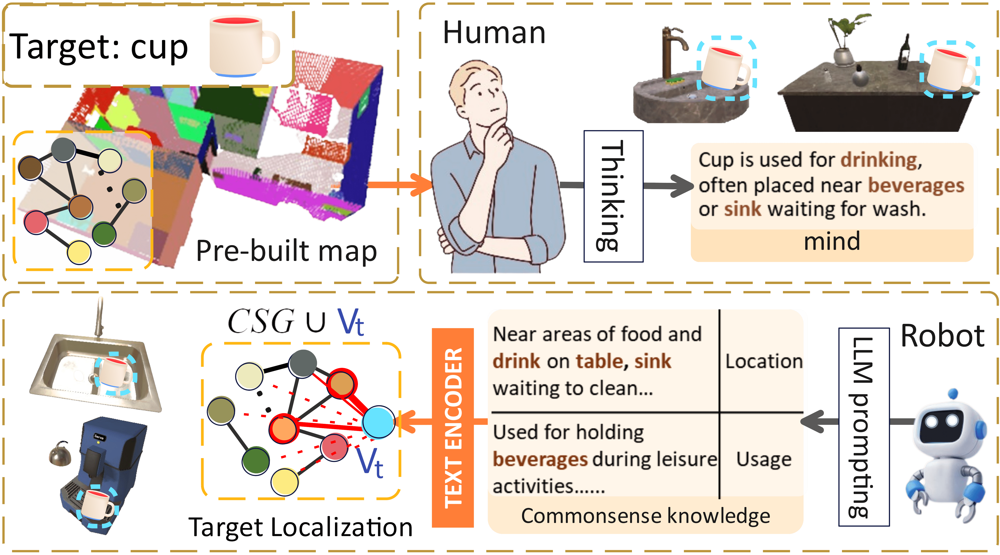

# csg-os
Commonsense Scene Graph-based Target Localization for Object Search

## Abstract
Object search is a fundamental skill for household robots, yet the core problem lies in the robot's ability to locate the target object accurately. The dynamic nature of household environments, characterized by the arbitrary placement of daily objects by users, makes it challenging to perform target localization. To efficiently locate the target object, the robot needs to be equipped with knowledge at both the object and room level. However, existing approaches rely solely on one type of knowledge, leading to unsatisfactory object localization performance and, consequently, inefficient object search processes. To address this problem, we propose a commonsense scene graph-based target localization, CSG-TL, to enhance target object search in the household environment. Given the pre-built map with stationary items, the robot models the room-level knowledge with object-level commonsense knowledge generated by a large language model (LLM) to a commonsense scene graph (CSG), supporting both types of knowledge for CSG-TL. To demonstrate the superiority of CSG-TL on target localization, extensive experiments are performed on the real-world ScanNet dataset and the AI2THOR simulator. Moreover, we have extended CSG-TL to an object search framework, CSG-OS, validated in both simulated and real-world environments. Code and videos are available at https://sites.google.com/view/csg-os.

